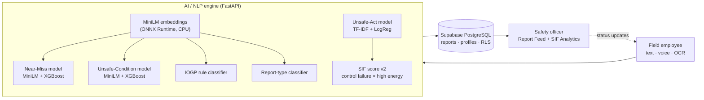

# OIL Guardian AI

**AI/NLP engine that detects Serious Injury & Fatality (SIF) precursors in Oil India Limited's safety reports.**

Smart India Hackathon 2026 · Problem Statement **SIH26165** · Theme: Smart Automation · Category: Software
Team **LogicLoom_** (Team ID 178528)

🔗 **Live demo:** https://oil-guardian-ai-xxhn.onrender.com
### 🔑 Demo access

The live prototype has two ready-to-use demo accounts, one for each role. The login page also has **Use Employee demo** / **Use Safety Officer demo** buttons that fill these in for you.

| Role | Email | Password | What you can try |
|---|---|---|---|
| Field Employee | `demo.employee@gmail.com` | `OilDemo@2026` | Submit a report by typing, voice or OCR; see the instant SIF score, risk tier and IOGP Life-Saving Rule; track review status |
| Safety Officer | `demo.officer@gmail.com` | `OilDemo@2026` | Review all reports ranked by risk, update status and remarks, confirm report type, open the SIF-Precursor Analytics dashboard |

**Quick demo flow**
1. Sign in as **Employee**, then submit: *"Welder started cutting on crude pipeline without gas test and without hot work permit"*
2. Look at the AI result: a high SIF score, the **Hot Work** rule and the energy evidence
3. Sign out, sign in as **Safety Officer**, find the report at the top of the feed and update its status
4. Open **SIF-Precursor Analytics** to see site and rule hotspots

*(Demo accounts contain test data only. On free hosting, the first sign-in after a quiet period can take up to a minute while the server wakes up.)*

---

## The problem

Oil India Limited collects large volumes of Unsafe-Act / Unsafe-Condition observations, near-miss and incident reports, but they are reviewed manually, monthly or quarterly. Research cited in the problem statement shows that in the US non-fatal accidents fell 51% over 15 years while fatalities fell only 25.5%: low-severity incidents don't share the causes of fatalities, and leading operators separately flag the ~20–25% of reports that carry genuine fatal potential.

The problem statement asks for a prototype that, for every free-text report:

| Requirement | OIL Guardian AI |
|---|---|
| **(a)** Classify as SIF-potential vs non-SIF | EEI-based SIF score: *control failure × high-energy check*; the API also returns the high-energy evidence it found |
| **(b)** Tag the relevant IOGP Life-Saving Rule | Trained classifier over the 9 IOGP rules + "None", with a confidence score |
| **(c)** Dashboard ranking sites/activities by SIF-precursor density | SIF analytics: density rankings and charts, site × rule heatmap, recurring high-energy hazards, weekly trend |

## What it does

**Field employee**
- Reports by **typing**, **voice** (browser speech recognition, Indian English) or **OCR** (live camera scan or photo upload, read in the browser)
- Answers "*What are you reporting?*" in plain language (Unsafe Act / Unsafe Condition / Near Miss / Incident / Not sure); the AI suggests a type if unsure
- Gets an instant AI assessment: SIF potential score, risk tier, IOGP Life-Saving Rule, report type
- Transmits the report and tracks its review status

**Safety officer**
- **Report Feed:** every report, ranked and filterable by risk, type and status; per-model scores; status workflow with investigator and remarks (each review recorded with the reviewer and time); confirms or corrects the report type
- **SIF-Precursor Analytics:** charts for risk tiers, report types, review status and input channel; SIF density by site, department and report type; site × Life-Saving Rule heatmap; recurring high-energy hazards; weekly trend

**Security**
- Supabase authentication with row-level security: employees see only their own reports; only approved safety officers see and update all reports
- Nobody can make themselves an officer: new accounts are always `employee`, officer requests are approved by an administrator

## Architecture



| Layer | Technology |
|---|---|
| Frontend | React + Vite (mobile-friendly), Tesseract.js (in-browser OCR), Web Speech API (voice) |
| AI backend | Python FastAPI, scikit-learn, XGBoost, MiniLM (`all-MiniLM-L6-v2`) via ONNX Runtime; **no GPU, no PyTorch, no paid AI APIs** |
| Data & auth | Supabase (PostgreSQL, authentication, row-level security) |
| Hosting | Render (the whole AI backend runs in under 512 MB RAM) |

## How the AI works

**SIF score v2 (`ensemble/sif_scoring.py`).** Based on the EEI SIF precursor model: a report has SIF potential when **high energy is present and the control that should manage it failed**.
1. *Control failure* = Unsafe-Act model probability, judged against the threshold chosen on its own validation set (0.34)
2. *High energy* = does the report mention a hazard from the EEI energy categories (height, electrical, pressure, lifting, machinery, vehicles, fire/hot work, toxic or confined atmosphere, excavation, bypassed safety systems)? If not, the score is halved.
3. The score is rescaled so **50% = the SIF decision threshold**. Tiers: High ≥ 70%, Moderate 50–70% (SIF-flagged), Low < 50%.

It is a ranking score, not a calibrated probability. The near-miss and unsafe-condition model scores are still returned for transparency.

**IOGP rule classifier (`ml_modules/iogp_rule/`).** Logistic regression on MiniLM embeddings, 9 IOGP Life-Saving Rules + "None". The API returns the confidence, the top-3 rules and a low-confidence flag.

**Report-type classifier (`ml_modules/report_type/`).** MiniLM embeddings + explainable cue words + logistic regression. Its output is a suggestion: the employee's answer and the officer's confirmation take priority, and both are stored for future retraining.

## Measured results

Models are built on **5,501 synthetic oil-and-gas reports** across 4 datasets (unsafe-act 3,443 · near-miss 799 · unsafe-condition 835 · field-style 424). All numbers below come from reproducible scripts in `scripts/` and test sets that were never used for training.

| Component | Test | Result |
|---|---|---|
| SIF score | 72 unseen reports: 30 dangerous/controlled pairs (same job, with and without controls) + 12 independent cases | AUC **0.73 → 0.82** vs the original soft-vote ensemble; recall **0.82**; precision **0.76**; F1 **0.79**; accuracy **0.76** |
| IOGP rule classifier | Held-out 80/20 split (10 classes) | Accuracy **55%** (random ≈ 10%) |
| | Strict grouped test (unseen hazard wording) | Accuracy **42%** |
| | Independent 12-report test set | **8 / 12** |
| Report type | All 72 evaluation reports | **73.6%** (was 50.0%); honest estimate ~75–85% |

**Honest limitations**
- All training data is **synthetic** (OIL's real HSSE data was not available). The pipeline is built to retrain on real reports with one command.
- The high-energy word list was written after seeing evaluation results, so its share of the SIF improvement is indicative until tested on new reports.
- In-browser OCR reads printed and typed forms well; **handwriting is not read reliably**.
- Voice input needs Chrome or Edge with an internet connection.

## Running locally

**Requirements:** Python 3.14, Node.js 20+, a Supabase project (see `docs/supabase_setup.sql`).

**Backend** (repo root):
```bash
python -m venv .venv
.venv\Scripts\activate            # macOS/Linux: source .venv/bin/activate
pip install -r requirements.txt
python -m ml_modules.shared_embedder   # downloads the ONNX MiniLM model once
uvicorn backend.api:app --reload --port 8000
```
Check `http://127.0.0.1:8000/api/health` and `http://127.0.0.1:8000/docs`.

**Frontend:**
```bash
cd frontend
cp .env.example .env               # then fill in your Supabase URL and publishable key
npm install                        # Windows PowerShell: npm.cmd install
npm run dev
```
Open `http://localhost:5173` (the backend only accepts this origin locally).

**Retraining and evaluation:**
```bash
python -m scripts.train_iogp_classifier        # IOGP rule classifier + metrics
python -m scripts.train_report_type_classifier # report-type classifier + metrics
python -m scripts.evaluate_sif                 # SIF scoring comparison on the paired set
python -m scripts.compare_embedders            # ONNX vs sentence-transformers check
```

## Deployment (Render)

`render.yaml` defines two services:
- **ML backend** (`oil-guardian-ai-ml`): build `pip install -r requirements.txt && python -m ml_modules.shared_embedder`, start `uvicorn backend.api:app --host 0.0.0.0 --port $PORT`
- **Frontend** (static site): env vars `VITE_API_URL`, `VITE_SUPABASE_URL`, `VITE_SUPABASE_PUBLISHABLE_KEY`; add a rewrite rule `/*` → `/index.html`

Changing a `VITE_*` variable requires a frontend rebuild. In Supabase, set the Site URL to the live frontend and add both the live URL and `http://localhost:5173/**` to the redirect URLs.

## Repository structure

```
backend/api.py                  FastAPI app: /api/analyze, /api/health
ensemble/sif_scoring.py         SIF score v2 (EEI logic)
ml_modules/shared_embedder.py   MiniLM via ONNX Runtime (shared by all models)
ml_modules/near_miss/           Near-miss model
ml_modules/unsafe_act/          Unsafe-act model (control-failure signal)
ml_modules/unsafe_condition/    Unsafe-condition model
ml_modules/iogp_rule/           IOGP Life-Saving Rule classifier
ml_modules/report_type/         Report-type classifier + field-style dataset
evaluation/                     SIF evaluation set and results
scripts/                        Training and evaluation scripts
docs/                           Labelling guide, Supabase setup
frontend/src/pages/             Login, Employee, Officer pages
frontend/src/components/dashboard/  SIF-precursor analytics
```

## Roadmap

- **Pilot:** bulk import from OIL's HSSE platform; retrain on real reports; HSE team owns retraining
- **Next:** multi-language reports (Hindi, Assamese and other regional languages, typed and voice)
- **Then:** handwritten-form OCR with a stronger engine; barrier-failure extraction and corrective-action suggestions
- **Scale:** on-premise rollout to all OIL sites, then other oil & gas PSUs

## Team LogicLoom_

| Member | Contribution |
|---|---|
| **Vinayak Pattar** (Team Leader) | Unsafe-Act model (with Huzaif); AI improvements: IOGP Life-Saving Rule classifier, SIF score v2, report-type classifier, paired validation cases |
| **Mahamad Huzaif Patel** | Unsafe-Act model (with Vinayak); backend and frontend, model ensembling, Supabase authentication and data flow, deployment, voice and OCR input, documentation |
| **Sai Sujay** | Near-Miss model (with Ullas); SIF-precursor analytics dashboard; frontend support |
| **Ullas M J** | Near-Miss model (with Sai); presentation and research |
| **Sourabh Toragal** | Unsafe-Condition model (with Chintamani); quality review and testing |
| **Chintamani** | Unsafe-Condition model (with Sourabh); team support |

**Model training:** each of the three specialist models was built by a pair: Unsafe Act (Vinayak & Huzaif), Near Miss (Ullas & Sai), Unsafe Condition (Sourabh & Chintamani).

## References

1. DEKRA / Martin & Black (2015) — SIF precursor study
2. EEI SIF Precursor / Safety Classification and Learning model
3. VelocityEHS (2024–25) — PSIF classifier
4. IOGP Report 459 — Life-Saving Rules
5. Reimers & Gurevych (2019) — Sentence-BERT
6. Chen & Guestrin (2016) — XGBoost
7. OSHA (osha.gov) — injury and fatality data
8. OISD (oisd.gov.in) — Oil Industry Safety Directorate
